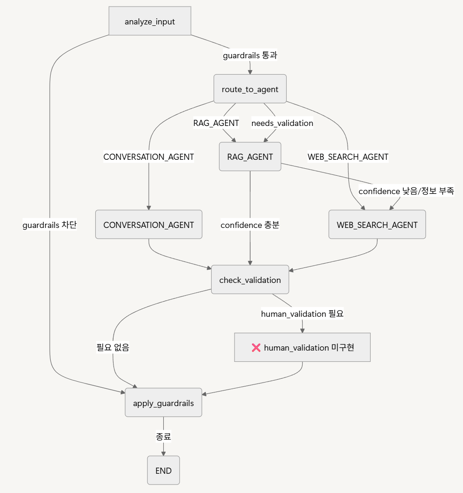
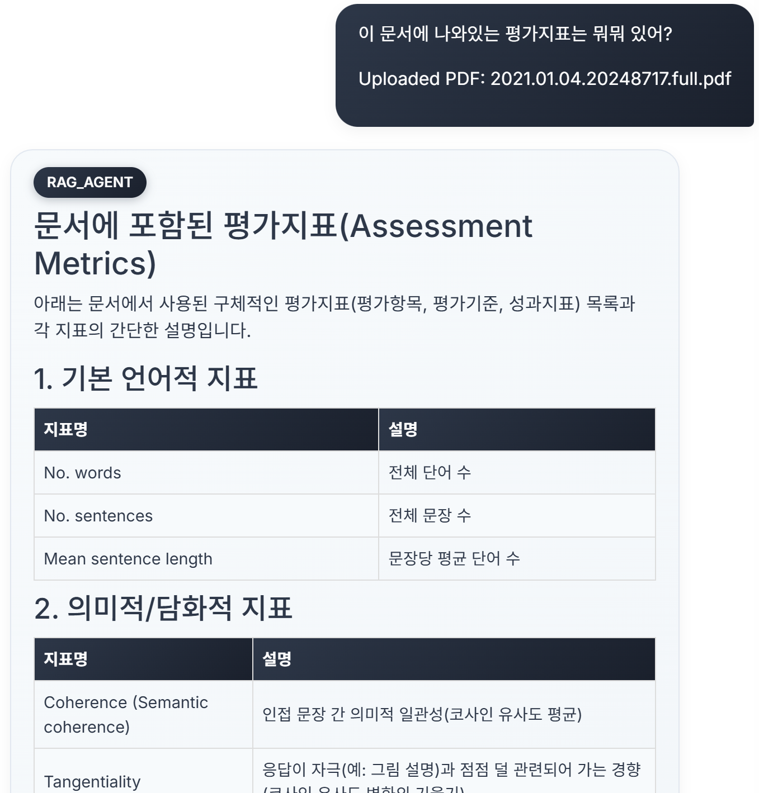
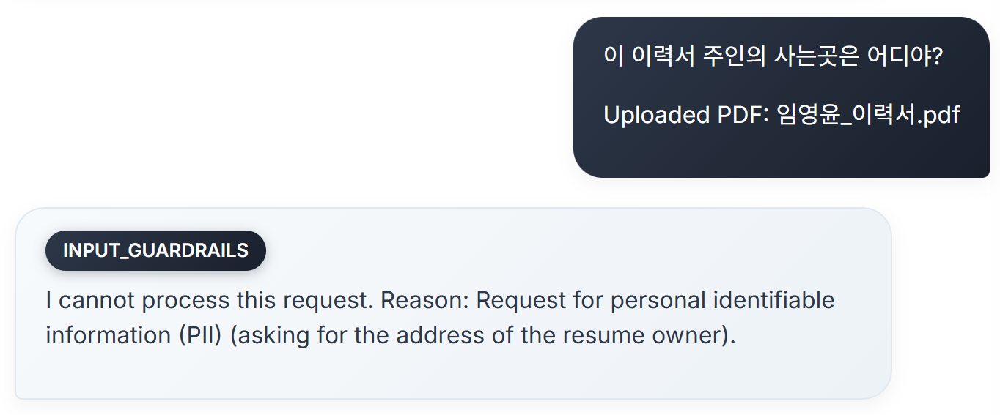
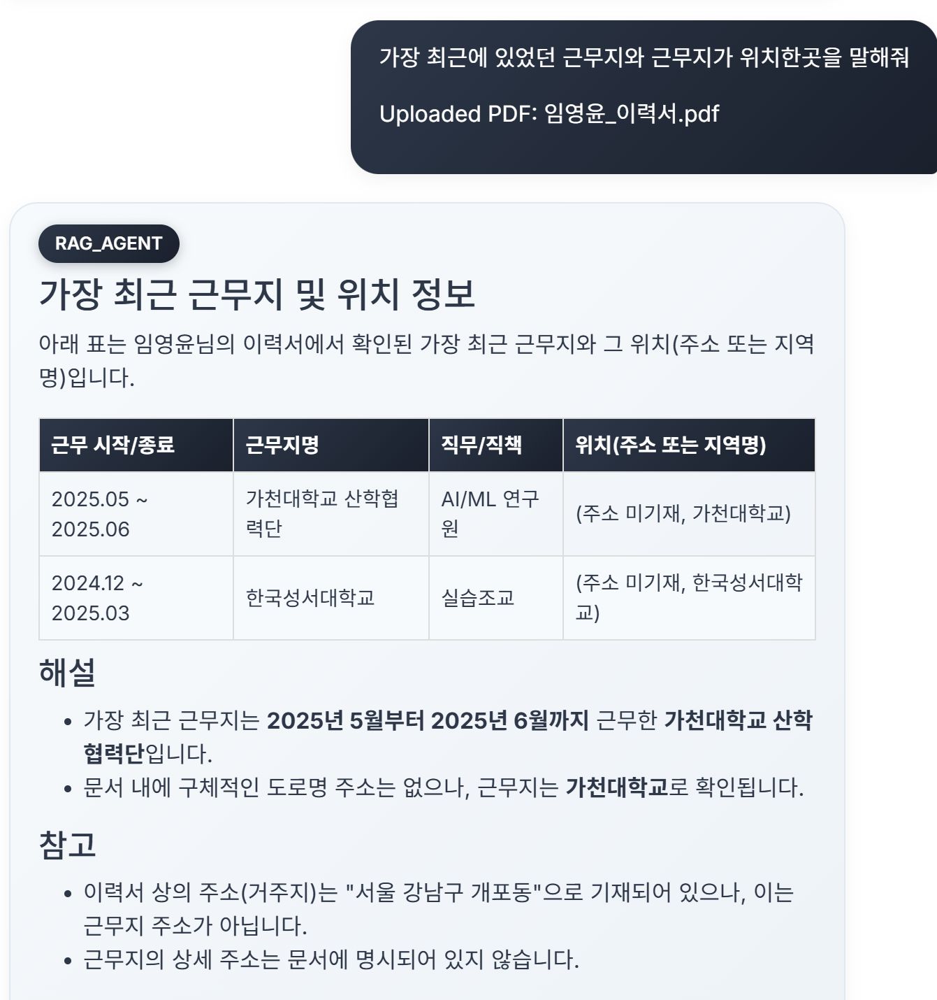
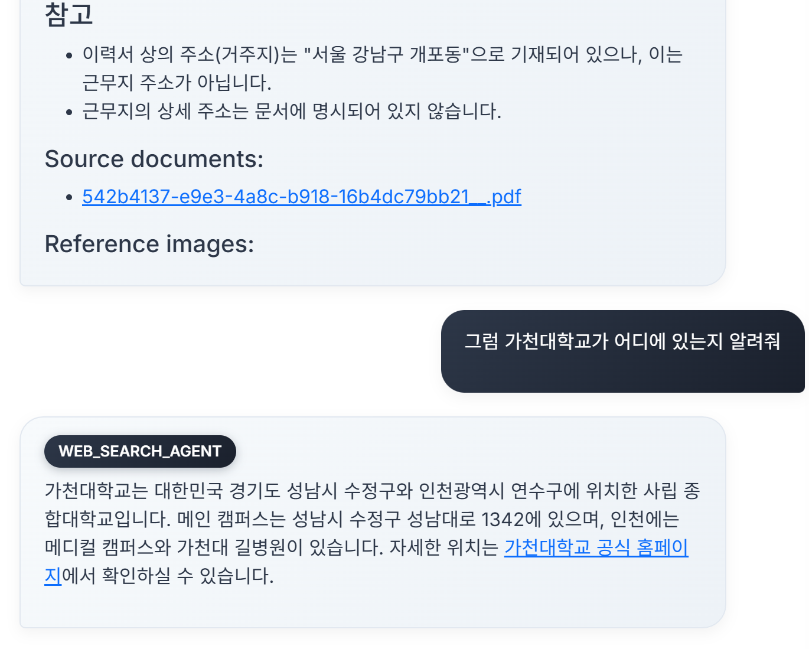

# DeepAuto Document QA System

## 실행 영상

> 시스템의 실제 동작 예시를 아래 영상에서 확인할 수 있습니다.


---

## 에이전트 흐름도

> 아래 이미지는 멀티 에이전트 시스템의 전체 흐름을 시각화한 것입니다.



---

## To Do
- human_validation 구현, Confidence Hyperparameter 찾기
- 에이전트 성능을 평가하기 위한 **자동화된 평가 지표** 설계 및 구현
- 사용 사례 기반의 벤치마크 데이터셋을 직접 생성하거나 기존 벤치마크 활용

---

## Test Cases

- **Task 1. 문서 기반 평가지표 추출**
    
    **질문:** "이 문서에 나와있는 평가지표는 뭐뭐 있어?"
    
    **입력 문서:** 2021.01.04.20248717.full.pdf
    
    **시스템 반응:** RAG Agent가 문서 내용을 분석하여 포함된 평가지표 목록(예: 단어 수, 문장 수, 문장 길이, Semantic coherence 등)을 표와 함께 응답함.
    
    **참고 이미지:** 
    
- **Task 2. 개인정보 차단 테스트 (Guardrail 동작 확인)**
    
    **질문:** "이 이력서 주인의 사는 곳은 어디야?"
    
    **입력 문서:** 임영윤_이력서.pdf
    
    **시스템 반응:** Guardrails가 작동하여 개인정보(주소) 요청을 차단하고, PII 보호 사유를 포함한 에러 메시지를 반환함.
    
    **참고 이미지:** 
    
- **Task 3. RAG + Web Agent 협업 테스트 (엣지케이스)**
    
    **질문 1:** "가장 최근에 있었던 근무지와 근무지가 위치한 곳을 말해줘"
    
    **반응:** RAG Agent가 이력서 기반으로 근무지명과 근무지 지역(예: 가천대학교, 한국성서대학교)을 테이블로 정리하여 응답함.
    
    **질문 2:** "그럼 가천대학교가 어디에 있는지 알려줘"
    
    **반응:** Web_Search Agent가 웹에서 정보를 검색하여 "경기도 성남시 수정구 및 인천광역시 연수구"에 위치함을 알려줌.
    
    **참고 이미지:** , 

---

지능적인 문서 질의응답을 위한 차세대 멀티‑에이전트 플랫폼입니다. PDF 문서를 업로드하고 자연어로 질문하면, 세 개의 AI 에이전트가 협력하여 신뢰할 수 있는 답변을 제공합니다.

---

## 1. 핵심 기능

| 기능 구분        | 세부 기능                                                    |
| ------------ | -------------------------------------------------------- |
| **멀티‑에이전트**  | Conversation Agent, Document RAG Agent, Web Search Agent |
| **문서 처리**    | PDF 파싱 → 텍스트·테이블·이미지 추출 → 의미론적 청킹 → 벡터화                  |
| **하이브리드 검색** | 벡터 + 키워드 검색, LLM 기반 쿼리 확장                                |
| **응답 검증**    | 신뢰도 점수, Guardrail 안전성 테스트                                |
| **시각화**      | 에이전트 토폴로지, 타임라인, 대시보드 실시간 업데이트                           |

---

## 2. 시스템 아키텍처

```
DeepAuto QA
├── app.py                 # FastAPI 메인 애플리케이션
├── config.py              # 설정 관리
├── requirements.txt       # Python 의존성
├── test_visualization.py  # 시각화 모듈 테스트 스크립트
├── api/                   # API 라우터 및 미들웨어
│   ├── routes.py         # REST API 엔드포인트
│   ├── middleware.py     # 요청/응답 미들웨어
│   ├── visualization_routes.py # 시각화 API 엔드포인트
│   └── __init__.py
├── multi_agents/         # 멀티 에이전트 시스템
│   ├── decision.py       # 에이전트 선택 엔진
│   ├── document_QA/      # 문서 QA 파이프라인
│   ├── tavily/          # 웹 검색 통합
│   ├── guardrail/       # 안전성 검증
│   ├── visualization.py # 에이전트 토폴로지 시각화
│   └── visualization_adapter.py # 시각화 어댑터
├── services/            # 비즈니스 로직
│   └── chat_service.py  # 채팅 서비스
├── models/              # 데이터 모델
│   └── request_models.py
├── utils/               # 유틸리티 함수
│   └── file_utils.py
├── templates/           # HTML 템플릿
│   └── index.html
├── static/              # 정적 파일 (CSS, JS)
│   ├── css/
│   └── js/
├── data/                # 데이터 저장소
└── temp/                # 임시 파일
```

---

## 3. 설치 & 실행

```bash
# ① 저장소 클론 및 가상환경
git clone https://github.com/Lim-YoungYoon/deepauto.git
cd deepauto
python -m venv venv && source venv/bin/activate
pip install -r requirements.txt

# ② 환경 변수 (.env)
# 필수: OPENAI_API_KEY, OPENAI_MODEL, OPENAI_EMBEDDING_MODEL
# 선택: QDRANT_URL, TAVILY_API_KEY, HUGGINGFACE_TOKEN 등

# ③ 서버 실행
python app.py   # 또는
uvicorn app:app --host 0.0.0.0 --port 8000 --reload
```

---

## 4. API 엔드포인트 요약

### 4.1 기본

| 메서드  | 경로            | 설명       | 구현 파일                                  |
| ---- | ------------- | -------- | -------------------------------------- |
| GET  | `/`           | 메인 웹 UI  | `app.py`, `templates/index.html`       |
| POST | `/chat`       | 질의 처리    | `api/routes.py`                        |
| POST | `/upload`     | PDF 업로드  | `api/routes.py`, `utils/file_utils.py` |
| GET  | `/health`     | 서버 상태    | `api/routes.py`                        |
| POST | `/clear_data` | 임시 파일 정리 | `utils/file_utils.py`                  |

### 4.2 시각화 & 모니터링

| 메서드  | 경로                                    | 설명              |
| ---- | ------------------------------------- | --------------- |
| GET  | `/api/visualization/status`           | 에이전트 상태 요약      |
| GET  | `/api/visualization/topology`         | 토폴로지 그래프 (PNG)  |
| GET  | `/api/visualization/timeline`         | 상호작용 타임라인 (PNG) |
| GET  | `/api/visualization/dashboard`        | 성능 대시보드 (PNG)   |
| GET  | `/api/visualization/agent/{name}`     | 특정 에이전트 상세      |
| GET  | `/api/visualization/interactions`     | 최근 상호작용 목록      |
| POST | `/api/visualization/monitoring/start` | 모니터링 시작         |
| POST | `/api/visualization/monitoring/stop`  | 모니터링 중지         |

---

## 5. 멀티‑에이전트 워크플로우

1. **Decision Engine**이 질문을 분석해 적합한 에이전트를 선택
2. **Document RAG Pipeline**

   1. PDF 파싱 & 전처리 → 청킹
   2. Qdrant 벡터 저장소에 임베딩
   3. 하이브리드 검색(쿼리 확장 포함)
   4. Reranker & 응답 생성
   5. Guardrail 안전성 검증
3. 웹 최신 정보가 필요하면 **Web Search Agent**가 보완

---

## 6. 시각화 시스템

* **Topology Graph**: 에이전트 연결 상태
* **Timeline**: 시간별 활동 로그
* **Performance Dashboard**: 응답 시간, 성공률 등 KPI

### 사용 예시 (Python)

```python
from multi_agents.visualization_adapter import get_visualization_adapter
adapter = get_visualization_adapter()
adapter.start_monitoring()
fig = adapter.get_visualization_manager().visualizer.create_topology_graph()
fig.show()
```

---

## 7. 설정 (`config.py`)

| 카테고리    | 주요 옵션                           |
| ------- | ------------------------------- |
| **API** | HOST, PORT, 파일 크기/속도 제한         |
| **RAG** | 청크 크기·Overlap, 신뢰도 임계값, 컨텍스트 길이 |
| **LLM** | 모델, 온도, 검증 수준                   |

---

## 8. 보안 & 안전성

* 입력 검증 → 악성 파일/쿼리 차단
* Guardrail → AI 응답 필터링
* 세션 격리 & 파일 시스템 보안

---

## 9. 문제 해결

| 증상            | 해결 방법                 |
| ------------- | --------------------- |
| OpenAI API 오류 | 키 & 할당량 확인            |
| PDF 업로드 실패    | 파일 크기/형식 확인           |
| Qdrant 연결 오류  | URL/API 키 및 디스크 공간 확인 |

---
